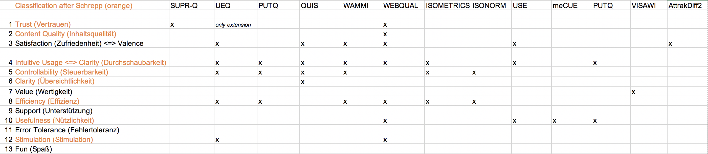

# emosat
Measuring LX

## Background 
In our surveys, all user experience aspects have been rated between -3 and 3. We calculated the mean value of all aspects. For both platforms, Schul-Cloud and openHPI, we extracted all important items, i.e., with a mean value higher than 1.5.

Martin Schrepp lists all relevant questionnaires in his book "User Experience mit Fragebögen messen" (2018). Unfortunately, there is no questionnaire that covers all aspects rated as important for Schul-Cloud and openHPI. Therefore, we decided to combine different questionnaires: 
(1) User Experience Questionnaire (UEQ, complete), 
(2) meCUE (only module 1) and 
(3) VisAWI-S (complete short version).

We concentrated us on questionnaires that (a) have been developed within several iterations, (b) are available for free, including information about the evaluation, and (c) wouldn't claim too much from regular users of Schul-Cloud and openHPI (not being in a testing environment). The table below shows all items of openHPI that have been rated > 1.5 sorted in a descending order. They include all Schul-Cloud items that have been rated > 1.5, too. It gives an short overview which aspects are covered through which questionnaires based on the information given by Schrepp. 



For all information about the surveys and their results, please have a look at the paper "Importance of UX Aspects for Learning Environments" by Mandy Klingbeil, Dominik Bruechner and Jan Renz.

## ER Diagram


## Running
Execute `npm install` first, then run the project with `node index.js`. It will then run on the default port 3000. If you want to specify a different port, use the command line option `--port`, e.g. `node index.js --port 5000`. Please note that for privileged ports (<1024) you need the according privileges, otherwise the execution will fail.

The application can then be reached in from a browser on the local machine at `http://localhost:<port>`.
 
## Visual appearance


## Use
In your web source file, create an empty div, for example add `<div id="my_survey_div"></div>`. Include the libraries as follows:
```xml
<link rel="stylesheet" href="https://use.fontawesome.com/releases/v5.5.0/css/all.css"
    integrity="sha384-B4dIYHKNBt8Bc12p+WXckhzcICo0wtJAoU8YZTY5qE0Id1GSseTk6S+L3BlXeVIU" crossorigin="anonymous">
<script src="https://ajax.googleapis.com/ajax/libs/jquery/3.3.1/jquery.min.js"></script>
<link rel="stylesheet" type="text/css" href="lib/surveytool/survey.css">
<script src="lib/surveytool/surveytool.js"></script>
```

In your JS code, call `init_survey({div_name: "my_survey_div"});`. Optionally, you can also provide a session/user id (depending on the use case): `init_survey({div_name: "my_survey_div", session_id: "0000-1234-5678"});`. If none is provided, a UUID is generated on the server side. The session ID should not be possible to guess for the user, as otherwise other user's survey results could be influenced. Therefore internal and external ID of the session are clearly distinguished throughout the application.

If the survey server's request URL needs to be adapted, e.g. because it is running behind a reverse proxy, use `init_survey({div_name: "my_survey_div", server_prefix: "/surveytool"});`

## Adding questions

A survey might consist of multiple questions. A series of surveys can be created, so that the individual surveys are presented to the user in a pre-defined order:

```javascript
  // Create a new survey
  var test_survey_id = create_survey("test_survey", "The TEST survey");

  // Create a new question
  var question_id = add_question("two_type_7", { 
      responses: ["inspiring", "boring"], 
      categories: ["funny_questions"] 
    });
  
  // Add the question to the survey
  add_question_to_survey(test_survey_id, question_id);

  // Create a new series
  var default_series_id = create_series("Default Series");
  // Add the survey to the series
  add_survey_to_series(default_series_id, test_survey_id);
  ```

There are currently four different questions types available: `single_type_5` (A single statement with five options to rate it) and `two_type_5` (two words/word groups with five options between them), as well as `single_type_7` and `two_type_7` which are like the types before, but with seven options to pick from.

Each question can be tagged with categories, which can later be used for evaluation. The backend also allows to retrieve all questions of a certain category.

## Endpoints for evaluation
`/results/answers/json` and `/results/answers/csv` resturn the answers for the individual questions as JSON and respectively CSV. Same applies for `/results/sentiments/json` and `/results/sentiments/csv`, which contain the initial user sentiment. NPS values are available from `/results/nps/csv` and `/results/nps/json`.

There might be several answers for a single questions and a single session ID, as the data is immediately transferred to the backend. If only the final result is of interes, all others can be ignored. This can be facilitated by using the `single_answer=true` URL parameter.

If only entries for a specific session ID are of interest, the session_id can be specified with the GET parameter `sid`, e.g. `/results/sentiments/json?sid=c6aed210-416c-11e9-9ec8-036a18eb7040`.


`/results/sessions` returns a list of sessions stored in the system with the corresponding activity time range (`from_time` and `to_time`).